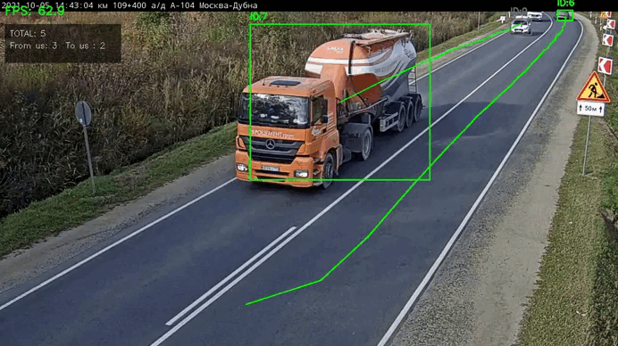

# VehicleTrack
##  Задача: 
На вход даётся видеозапись транспортного потока с камеры видеонаблюдения. Камера расположена статически, ракурс не изменяется.
С помощью детектора на основе нейронных сетей необходимо детектировать транспортные средства (ТС). На выходе детектора – bounding box’ы (bbox, ббокс).
Разрешается и рекомендуется использовать предобученные модели.

• Реализовать трекер ТС <br>
• Реализовать подсчет ТС по двум направлениям (к камере и от камеры)<br>
• Реализовать визуализацию детектора и трекера. Визуализатор должен отображать bounding box’ы и треки.
##
## Пример:



### Установка
#### Шаг 1. Клонировать репозиторий

```bash
git clone git@github.com:alkonorov/VehicleTrack.git
```
## Установка и запуск

### Установка

```bash
# Клонировать репозиторий
git clone https://github.com/alkonorov/VehicleTrack.git
cd VehicleTrack
```
#### Создать виртуальное окружение
```bash
python -m venv venv
source venv/bin/activate  # Linux/Mac
# venv\Scripts\activate   # Windows
```
#### Установить зависимости
```bash
pip install -r requirements.txt
```
#### Подготовить данные
Положить модель yolo26n.onnx в папку model/ (если ее там нет)<br>

**Положить видеофайл в data/test_video.mp4 (или указать свой путь в config.py → VIDEO_PATH)!!**

# ЗАПУСК
## Запуск с отображением видео (на CPU)
```bash
python main.py -v data/test_video.mp4 -o output/result.mp4
```
Будет обрабаывается видео в окне с отрисованными bbox и треками, а обработанное видео запишется в папку output

### Справка по  остальным аргументам
```bash
python main.py --help
```
```
Аргументы командной строки
Аргумент	Коротко	По умолчанию	Описание
--video	-v	из config.py	Путь к входному видео
--model	-m	из config.py	Путь к модели ONNX
--output	-o	output/result.mp4	Путь для сохранения результата
--device	-d	cpu	Устройство: cpu или cuda
--no-display		False	Не показывать окно (для сервера)
```

## Запуск через Docker (без отображения) 
***локально***
### 1. Клонировать репозиторий
git clone https://github.com/alkonorov/VehicleTrack.git
cd VehicleTrack
### 2. Положить видео в папку data/
**видео должно нзываться test_video.mp4** !

### 3. Собрать и запустить
docker compose build
docker compose up    
